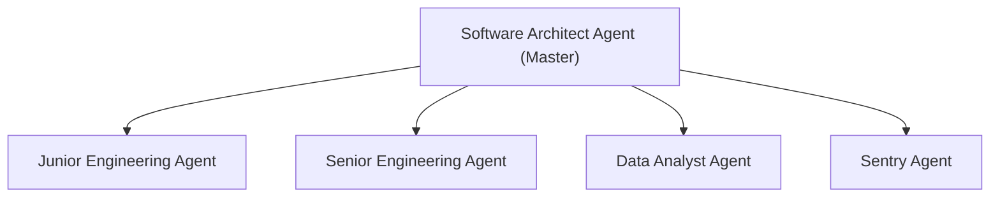
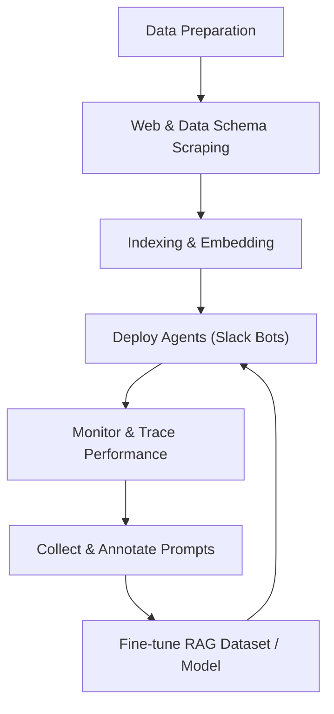

# Decentralised Software Agents for Startups and Enterprises

## Table of Contents
- [Overview](#overview)
- [Why io.net?](#why-ionet)
- [Agents and Capabilities](#agents-and-capabilities)
- [System Architecture](#system-architecture)
- [End-to-End Workflow](#end-to-end-workflow)
- [How to Use This Repository](#how-to-use-this-repository)
- [Preparation for Agents Team](#preparation-for-agents-team-pre-deployment-phase)
- [Deploy Agents Team](#deploy-agents-team)
- [Monitor and Self-Improve](#monitor-and-self-improvement-of-agents-team)

---

## Overview
Nowadays, agents can do mind-blowing things: write code, create content, and manage complex tasks autonomously. This repository is a collection of such agents that can be used to build your own AI applications.

With the help of **io.net io intelligence**, you can access open-source models at all times. If needed, you can deploy your own model on the io.net platform. io.net provides both CaaS (Cluster as a Service) and Baremetal clusters to deploy LLM models, which can be used to build all these enterprise agents.

---

## Multi-Bot Architecture

The system now supports multiple specialized Slack bots, each with dedicated capabilities:

### 🏗️ Architect Agent (`@architect-bot`)
- Deep research and analysis
- Data visualization and insights  
- Documentation search and synthesis
- Multi-tool orchestration

### 👨‍💻 Developer Agent (`@developer-bot`)
- Pull request reviews and creation
- Code quality analysis
- PR comment handling and resolution
- GitHub integration

### 📊 Data Analyst Agent (`@data-analyst-bot`)
- Network data analysis
- SQL query generation and execution
- Report generation with visualizations
- Performance metrics and insights

### 🚨 Sentry Agent (`@sentry-bot`)
- Error debugging and analysis
- Sentry issue investigation
- Log analysis and troubleshooting
- Production issue resolution

### 🤖 Main Dispatcher (`@main-bot`)
- Central coordination and help
- File processing (audio/video transcription)
- Agent discovery and routing

---

## Why io.net?

**io.net** is central to this repository's philosophy and architecture:

- **Data Privacy & Compliance:** By controlling the LLM model, you ensure data privacy and compliance with regulations. Proprietary code and sensitive data can be shared with the model without fear of leaks, since everything is self-hosted.
- **Self-Hosting:** You can save conversations, collect datasets, and use io.net's TaaS (Training as a Service) to train or fine-tune models with your own data. This enables a complete self-improving lifecycle for your agent ecosystem.
- **Flexible Deployment:** Use io.net's CaaS or Baremetal clusters to deploy and scale LLMs as needed for your organization.
- **R2R RAG APIs & Qdrant:** For data indexing and retrieval, leverage io.net's R2R RAG APIs. If you exceed daily limits, seamlessly switch to Qdrant as a vector store.
- **Continuous Improvement:** Gather data from agent conversations, annotate useful prompts, and fine-tune your RAG dataset for ever-improving performance.

> **In summary:** io.net empowers you to build, deploy, and continuously improve AI agents with full control, privacy, and scalability.

---

## Setup for Multi-Bot System

### Slack App Configuration

For the multi-bot architecture, you'll need to create **5 separate Slack Applications**:

1. **Architect Bot** - For research and analysis
2. **Developer Bot** - For code reviews and PR management  
3. **Data Analyst Bot** - For data analysis and reporting
4. **Sentry Bot** - For error debugging and monitoring
5. **Main Dispatcher Bot** - For coordination and file processing

For each Slack App:
1. Create the app at [Slack API](https://api.slack.com/apps)
2. Configure Bot User with appropriate scopes
3. Enable Socket Mode and generate App-Level Token
4. Install to your workspace
5. Copy the tokens to your `.env` file

### Environment Variables

Update your `.env` file with tokens for each bot:

```env
# Main Dispatcher Bot
SLACK_BOT_TOKEN=xoxb-...
SLACK_APP_TOKEN=xapp-...
SLACK_SIGNING_SECRET=...

# Architect Bot
SLACK_ARCHITECT_BOT_TOKEN=xoxb-...
SLACK_ARCHITECT_APP_TOKEN=xapp-...
SLACK_ARCHITECT_SIGNING_SECRET=...

# Developer Bot  
SLACK_DEVELOPER_BOT_TOKEN=xoxb-...
SLACK_DEVELOPER_APP_TOKEN=xapp-...
SLACK_DEVELOPER_SIGNING_SECRET=...

# Data Analyst Bot
SLACK_DATA_ANALYST_BOT_TOKEN=xoxb-...
SLACK_DATA_ANALYST_APP_TOKEN=xapp-...
SLACK_DATA_ANALYST_SIGNING_SECRET=...

# Sentry Bot
SLACK_SENTRY_BOT_TOKEN=xoxb-...
SLACK_SENTRY_APP_TOKEN=xapp-...
SLACK_SENTRY_SIGNING_SECRET=...
```

### Running the Multi-Bot System

```bash
# Run all specialized bots
python multi_bot_main.py

# Or run the original single bot
python slack_bot_main.py
```

---

## Agents and Capabilities

| Agent                  | Capabilities                                                                                                                                                                                                 |
|------------------------|------------------------------------------------------------------------------------------------------------------------------------------------------------------------------------------------------------|
| **Software Architect** | - Research, plan, and coordinate tasks across all agents<br>- Provide end-to-end solutions<br>- Acts as the master agent                                              |
| **Junior Engineer**    | - Read docs, write code, create PRs<br>- Handle PR comments and reviews                                                                                               |
| **Senior Engineer**    | - All Junior Engineer capabilities<br>- Handle complex tasks<br>- Review code<br>- Provide architectural guidance<br>- Deep understanding of codebase and frameworks   |
| **Data Analyst**       | - Analyze data, generate reports, provide insights<br>- Create dashboards and visualizations                                                                           |
| **Sentry Agent**       | - Monitor applications<br>- Detect issues<br>- Provide alerts                                                                                                         |

---

## Bot Commands Reference

### Architect Agent Commands
- `ask architect <question>` - Comprehensive research
- `data-analyst <question>` - Quick data analysis
- `engineer docs <question>` - Documentation search

### Developer Agent Commands  
- `review pr <github_url>` - Review pull requests
- `create pr` - Create new pull requests
- `handle comments <pr_url>` - Address PR feedback

### Data Analyst Agent Commands
- `analyze data <question>` - Analyze network data
- `sql query <request>` - Generate SQL queries
- `generate report <topic>` - Create reports

### Sentry Agent Commands
- `handle sentry` - Debug Sentry issues (use in alert threads)
- `debug error <description>` - General error debugging
- `analyze logs <content>` - Analyze log files

### Main Dispatcher Commands
- `help` - Show help message
- `agents` - List available agents
- Upload audio/video files for automatic processing

---

## System Architecture

### Agent Coordination Diagram

*The Software Architect Agent acts as the master, coordinating all other agents.*

---

## End-to-End Workflow


*The workflow is cyclical, enabling continuous self-improvement of the agent ecosystem.*

> **Note:** The workflows are designed for durable execution using [**DBOS (Durable Execution for AI Applications)**](https://dbos.dev/), ensuring that long-running processes are reliable and fault-tolerant.

---

## Workflow Diagrams

For detailed diagrams of the various workflows, please see the following README files:

- [**Core Module**](./core/README.md): Illustrates the Slack Bolt communication flow.
- [**Architect Agent**](./services/architect/README.md): Shows the workflow of the Architect Agent.
- [**Developer Services**](./services/developer/README.md): Contains diagrams for the PR review and PR creation workflows.
- [**Data Support Services**](./services/data_support/README.md): Illustrates the IODatabot workflow.
- [**Slack Setup**](./slack_setup/README.md): Provides detailed instructions for setting up the Slack bot.

---

## How to Use This Repository
This repository contains end-to-end code workflows to deploy agents to your organization.

Currently, all these agents are accessible from **Slack**. By using these agents:

- Each person can manage a team of agents to handle all tasks—everyone is leading a team of agents.
- Answer all questions about the codebase, architecture, and data.
- Create PRs, handle PR comments, and review code.
- **Importantly:** Vibe code the entire fixes, features, and improvements from the convenience of Slack. No editor needed—just io-intelligence and Slack is enough to create, manage, and improve code.
- Suddenly, every person in the organization is a product engineer, able to work on product improvements and suggest new things.
- This Agent Team can help achieve 10x productivity by collaborating and providing the best solutions.
- You can Slack call all these agents, explain the problem statement, and let the agents work on it while you focus elsewhere. Every software engineer is now a reviewer.

---

## Preparation for Agents Team (pre-deployment phase)
- **Web scraping:**
   - `rag/web_crawler/scraper.py` scrapes the organization's product description, API documentation, etc.
   - Check the scraped data sample in `data/docs_markdown`.
- **Data Schema Scraping from the RDS:**
    - `rag/sql_rag/qdrant_vector_store.py` scrapes the data schema from the RDS and creates a vector store for the data.
    - Additionally, adds the day-to-day SQLs used across the team.
- **Additional Data-related Questions:**
    - Gathered from teammates for daily use.
- **Indexing the data:**
    - `rag/indexer/indexer.py` indexes the data scraped from the web and RDS into a vector store.
    - Uses both io.net R2R RAG APIs and Qdrant as the vector store and SentenceTransformer for embedding the data.
        - Qdrant is used when the daily limit of R2R RAG APIs is exceeded; otherwise, R2R RAG APIs are sufficient.
   - `rag/indexer/embedder.py` embeds the data into the vector store and can be used to test the embedding of JSON files standalone.

---
## Deploy Agents Team
- Create a Slack bot and provide the API key for each bot.

---

## Monitor and Self-Improvement of Agents Team
- **Monitor:**
  - Monitor the conversations between the agents and the team.
  - Trace the performance, latency of API calls, tool calls, etc.
  - Use opik for observability and monitoring of the agents.
- **Self-improvement:**
  - By gathering data from the conversations, collect and annotate useful prompts.
  - Fine-tune the RAG dataset, which will eventually improve the performance of the agents.
  - Use TaaS to train the model with the collected data.

---

*More documentation and details will be added soon.*
