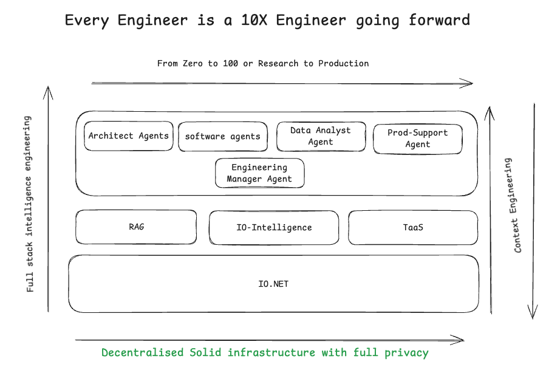
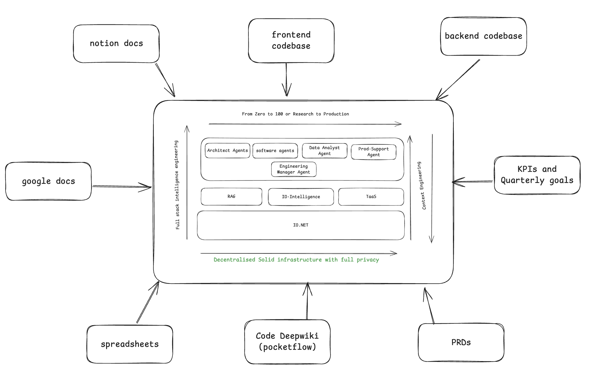
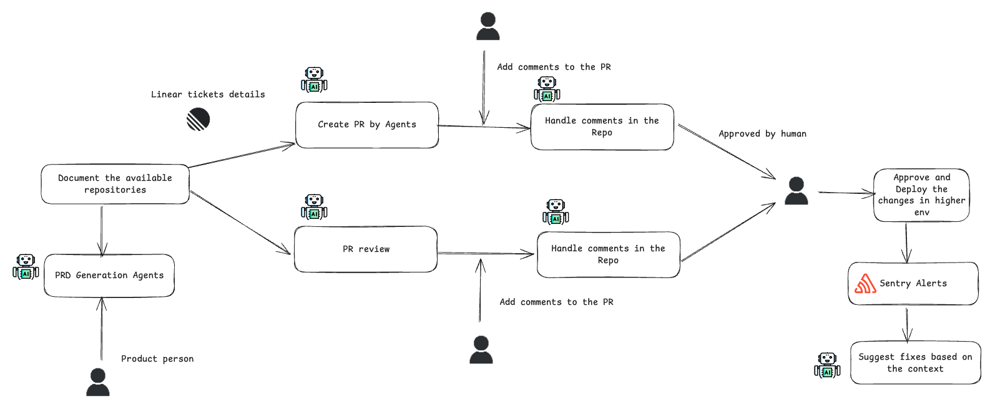
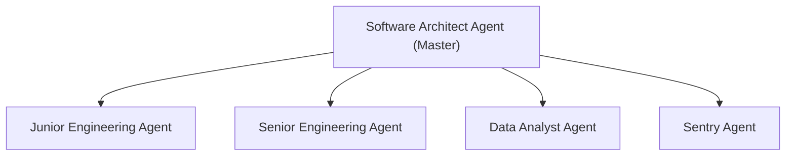
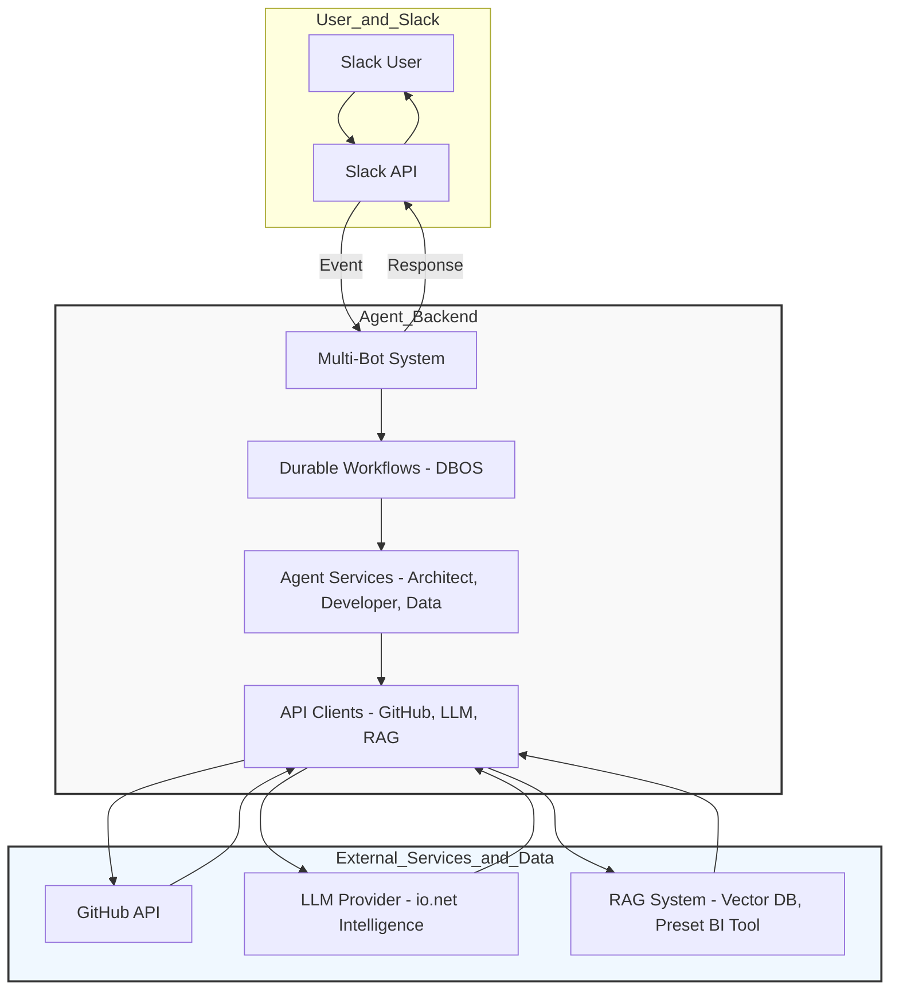

# Decentralised Software Agents for Startups and Enterprises


<a href="https://youtu.be/tGZxhFgC1m8" target="_blank">
  
</a>

**[📺 Watch the Demo & Explanation Playlist on YouTube](https://www.youtube.com/playlist?list=PLZDaBdSBp7PePrYxVWvBIRYLRybAydPN_)**

## Table of Contents
- [Overview](#overview)
- [Why io.net?](#why-ionet)
- [Agents and Capabilities](#agents-and-capabilities)
- [System Architecture](#system-architecture)
- [End-to-End Workflow](#end-to-end-workflow)
- [How to Use This Repository](#how-to-use-this-repository)
- [Preparation for Agents Team](#preparation-for-agents-team-pre-deployment-phase)
- [Deploy Agents Team](#deploy-agents-team)
- [Monitor and Self-Improve](#monitor-and-self-improvement-of-agents-team)

---

## Overview
Nowadays, agents can do mind-blowing things: write code, create content, and manage complex tasks autonomously. This repository is a collection of such agents that can be used to build your own AI applications.

With the help of **io.net io intelligence**, you can access open-source models at all times. If needed, you can deploy your own model on the io.net platform. io.net provides both CaaS (Cluster as a Service) and Baremetal clusters to deploy LLM models, which can be used to build all these enterprise agents.

This Agents Team benefits both the internal customers (employees) and external customers (clients).
---

---
## High level overview of the Hackathon project


- **By integerating with the io.net, Make your engineers 10x more productivityand let them enjoy their life in the free time** :) 


- **Success of Software Engineering Agents lies in the success of context engineering so context engineering infrastructure is important**


- End to end capabilities of the software agents


## 🤖 Multi-Bot Architecture

The system supports **5 specialized Slack bots**, each with dedicated capabilities and identities. For detailed documentation, see [**Core Module Documentation**](./core/README.md).

### Quick Overview
- 🏗️ **Architect Agent** - Deep research, data analysis, documentation
- 👨‍💻 **Developer Agent** - PR reviews, code creation, GitHub integration  
- 📊 **Data Analyst Agent** - SQL queries, reports, visualizations
- 🚨 **Sentry Agent** - Error debugging, log analysis, monitoring
- 🤖 **Main Dispatcher** - File processing, coordination, help

### Architecture Benefits
- **Specialized Identity**: Each agent appears as distinct bot in Slack
- **Modular Design**: Independent deployment and scaling
- **Clear Separation**: No command conflicts between agents
- **Better UX**: Users can directly mention specific agents
- **Maintainable**: Self-contained logic per agent

---

## Why io.net?

**io.net** is central to this repository's philosophy and architecture:

- **Data Privacy & Compliance:** By controlling the LLM model, you ensure data privacy and compliance with regulations. Proprietary code and sensitive data can be shared with the model without fear of leaks, since everything is self-hosted.
- **Self-Hosting:** You can save conversations, collect datasets, and use io.net's TaaS (Training as a Service) to train or fine-tune models with your own data. This enables a complete self-improving lifecycle for your agent ecosystem.
- **Flexible Deployment:** Use io.net's CaaS or Baremetal clusters to deploy and scale LLMs as needed for your organization.
- **R2R RAG APIs & Qdrant:** For data indexing and retrieval, leverage io.net's R2R RAG APIs. If you exceed daily limits, seamlessly switch to Qdrant as a vector store.
- **Continuous Improvement:** Gather data from agent conversations, annotate useful prompts, and fine-tune your RAG dataset for ever-improving performance.

> **In summary:** io.net empowers you to build, deploy, and continuously improve AI agents with full control, privacy, and scalability.

---

## Agents and Capabilities

| Agent                  | Capabilities                                                                                                                                                                                                 |
|------------------------|------------------------------------------------------------------------------------------------------------------------------------------------------------------------------------------------------------|
| **Software Architect** | - Research, plan, and coordinate tasks across all agents<br>- Provide end-to-end solutions<br>- Acts as the master agent                                              |
| **Junior Engineer**    | - Read docs, write code, create PRs<br>- Handle PR comments and reviews                                                                                               |
| **Senior Engineer**    | - All Junior Engineer capabilities<br>- Handle complex tasks<br>- Review code<br>- Provide architectural guidance<br>- Deep understanding of codebase and frameworks   |
| **Data Analyst**       | - Analyze data, generate reports, provide insights<br>- Create dashboards and visualizations                                                                           |
| **Sentry Agent**       | - Monitor applications<br>- Detect issues<br>- Provide alerts                                                                                                         |


## System Architecture

### Agent Coordination Diagram

*The Software Architect Agent acts as the master, coordinating all other agents.*

---

## High-Level System Flow

This diagram illustrates the end-to-end request lifecycle, from the user's message in Slack to the agent's response.


*The workflow is cyclical, enabling continuous self-improvement of the agent ecosystem.*

> **Note:** The workflows are designed for durable execution using [**DBOS (Durable Execution for AI Applications)**](https://dbos.dev/), ensuring that long-running processes are reliable and fault-tolerant.

---

## Workflow Diagrams

For detailed diagrams of the various workflows, please see the following README files:

- [**Core Module**](./core/README.md): **Multi-bot architecture, setup guide, and communication flows**
- [**Architect Agent**](./services/architect/README.md): Shows the workflow of the Architect Agent.
- [**Developer Services**](./services/developer/README.md): Contains diagrams for the PR review and PR creation workflows.
- [**Data Support Services**](./services/data_support/README.md): Illustrates the IODatabot workflow.
- [**Slack Setup**](./slack_setup/README.md): Provides detailed instructions for setting up the Slack bot.
- [**RAG System**](./rag/README.md): Explains the audio and video RAG workflows.

---

## 🚀 Quick Start

### 1. Setup Multi-Bot System
```bash
# Clone and install
git clone <repository>
pip install -r requirements.txt

# Configure environment (see core/README.md for details)
cp .env.example .env
# Add your Slack tokens for each bot

# Run all specialized bots
python multi_bot_main.py
```

### 2. Create Slack Applications
For detailed setup instructions, see [**Core Module Documentation**](./core/README.md#setup-and-configuration).

You'll need to create **5 separate Slack Apps** and configure tokens for each agent.

### 3. Basic Usage
```bash
# Research and analysis
ask architect How is the network performing?

# Code management  
review pr https://github.com/owner/repo/pull/123

# Data analysis
analyze data How many devices are online?

# Error debugging
handle sentry  # Use in Sentry alert threads

# Get help
help  # Shows all available commands
```

---

## How to Use This Repository
This repository contains end-to-end code workflows to deploy agents to your organization.

Currently, all these agents are accessible from **Slack**. By using these agents:

- Each person can manage a team of agents to handle all tasks—everyone is leading a team of agents.
- Answer all questions about the codebase, architecture, and data.
- Create PRs, handle PR comments, and review code.
- **Importantly:** Vibe code the entire fixes, features, and improvements from the convenience of Slack. No editor needed—just io-intelligence and Slack is enough to create, manage, and improve code.
- Suddenly, every person in the organization is a product engineer, able to work on product improvements and suggest new things.
- This Agent Team can help achieve 10x productivity by collaborating and providing the best solutions.
- You can Slack call all these agents, explain the problem statement, and let the agents work on it while you focus elsewhere. Every software engineer is now a reviewer.

---

## Preparation for Agents Team (pre-deployment phase)
- **Web scraping:**
   - `rag/web_crawler/scraper.py` scrapes the organization's product description, API documentation, etc.
   - Check the scraped data sample in `data/docs_markdown`.
- **Data Schema Scraping from the RDS:**
    - `rag/sql_rag/qdrant_vector_store.py` scrapes the data schema from the RDS and creates a vector store for the data.
    - Additionally, adds the day-to-day SQLs used across the team.
- **Additional Data-related Questions:**
    - Gathered from teammates for daily use.
- **Indexing the data:**
    - `rag/indexer/indexer.py` indexes the data scraped from the web and RDS into a vector store.
    - Uses both io.net R2R RAG APIs and Qdrant as the vector store and SentenceTransformer for embedding the data.
        - Qdrant is used when the daily limit of R2R RAG APIs is exceeded; otherwise, R2R RAG APIs are sufficient.
   - `rag/indexer/embedder.py` embeds the data into the vector store and can be used to test the embedding of JSON files standalone.
- **Codebase Documentation with IO.NET & PocketFlow:**
    - For details on integrating the IO.NET intelligence LLM with the [PocketFlow](https://github.com/The-Pocket/PocketFlow) document generator codebase, see [data/code_markdown/README.md](./data/code_markdown/README.md). This integration enables automated, high-quality documentation and code RAG for enhanced engineering productivity. The approach is inspired by [PocketFlow-Tutorial-Codebase-Knowledge](https://github.com/The-Pocket/PocketFlow-Tutorial-Codebase-Knowledge). This code Rag context is used by senior engineering Agents and Architect Agents for planning, decision and coding.


---
## Deploy Agents Team

### Multi-Bot Deployment (Recommended)
```bash
python multi_bot_main.py
```

### Single Bot Deployment (Legacy)
```bash
python slack_bot_main.py
```

For detailed setup instructions, see [**Core Module Documentation**](./core/README.md).

---

## Monitor and Self-Improvement of Agents Team
- **Monitor:**
  - Monitor the conversations between the agents and the team.
  - Trace the performance, latency of API calls, tool calls, etc.
  - Use opik for observability and monitoring of the agents.
- **Self-improvement:**
  - By gathering data from the conversations, collect and annotate useful prompts.
  - Fine-tune the RAG dataset, which will eventually improve the performance of the agents.
  - Use TaaS to train the model with the collected data.

---

## 📚 Documentation Structure

- [**Main README**](./README.md) - Overview and quick start
- [**Core Module**](./core/README.md) - **Multi-bot architecture and setup** ⭐
- [**Architect Service**](./services/architect/README.md) - Research agent workflows
- [**Developer Services**](./services/developer/README.md) - PR and code workflows  
- [**Data Support**](./services/data_support/README.md) - Data analysis workflows
- [**Slack Setup**](./slack_setup/README.md) - Slack bot configuration
- [**RAG System**](./rag/README.md) - Retrieval and indexing

---

*More documentation and details will be added soon.*


## More details kindly refer the existing PRs which are documented by the Agents (for incremental improvements):
- https://github.com/rajagurunath/software-engineering-agents/pull/2
- https://github.com/rajagurunath/software-engineering-agents/pull/3
- https://github.com/rajagurunath/software-engineering-agents/pull/4
- https://github.com/rajagurunath/software-engineering-agents/pull/5
