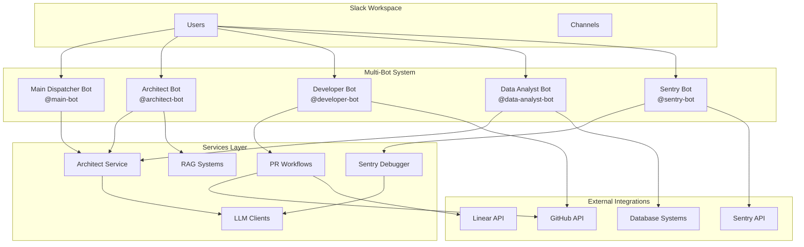
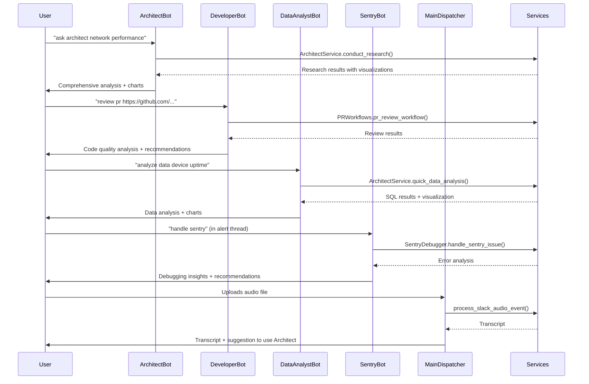

# Core Module - Multi-Bot Architecture

This module contains the core logic for the multi-bot Slack system, including specialized bot handlers, workflow orchestration, and integrations.

## Table of Contents
- [Multi-Bot Architecture Overview](#multi-bot-architecture-overview)
- [Specialized Bot Agents](#specialized-bot-agents)
- [Bot Commands Reference](#bot-commands-reference)
- [Setup and Configuration](#setup-and-configuration)
- [Communication Flow](#communication-flow)
- [File Structure](#file-structure)
- [Deployment Options](#deployment-options)

## Multi-Bot Architecture Overview

The system has evolved from a single monolithic Slack bot to a **distributed multi-bot architecture** with 5 specialized agents, each with dedicated capabilities and Slack identities.

### Architecture Benefits

1. **🎯 Specialized Identity**: Each agent appears as a distinct bot in Slack with unique personalities
2. **🔧 Modular Design**: Easy to add/remove agents independently without affecting others
3. **📈 Scalable**: Each bot can be deployed separately and scaled based on usage
4. **🚫 Clear Separation**: No command conflicts between agents - each has its own namespace
5. **👥 User Experience**: Users can directly mention specific agents for targeted help
6. **🛠️ Maintainable**: Each bot's logic is self-contained and easier to debug

### System Architecture Diagram



## Specialized Bot Agents

### 🏗️ Architect Agent (`@architect-bot`)
**Purpose**: Master coordinator for deep research, analysis, and multi-tool orchestration

**Core Capabilities**:
- Comprehensive research combining multiple data sources
- Data visualization with interactive charts
- Documentation synthesis and analysis
- Multi-step workflow orchestration
- Context-aware analysis with user/device targeting

**Use Cases**:
- "How is the io.net network performing this month?"
- "Analyze device performance for user abc123"
- "Research the impact of recent code changes"

### 👨‍💻 Developer Agent (`@developer-bot`)
**Purpose**: Complete GitHub workflow automation and code quality management

**Core Capabilities**:
- Automated PR reviews with quality scoring
- Intelligent PR creation from descriptions
- PR comment resolution and code fixes
- GitHub integration and workflow automation
- Linear ticket integration

**Use Cases**:
- Code reviews and quality analysis
- Automated feature implementation
- PR comment resolution
- GitHub workflow automation

### 📊 Data Analyst Agent (`@data-analyst-bot`)
**Purpose**: Network data analysis, reporting, and business intelligence

**Core Capabilities**:
- SQL query generation and execution
- Interactive data visualizations
- Comprehensive report generation
- Performance metrics analysis
- Business intelligence insights

**Use Cases**:
- Network performance analysis
- Business metrics reporting
- Data-driven decision support
- Performance monitoring

### 🚨 Sentry Agent (`@sentry-bot`)
**Purpose**: Production monitoring, error debugging, and incident response

**Core Capabilities**:
- Sentry issue analysis and debugging
- Log analysis and pattern recognition
- Error root cause analysis
- Production incident response
- Automated debugging workflows

**Use Cases**:
- Production error investigation
- Log analysis and troubleshooting
- Incident response automation
- Error pattern analysis

### 🤖 Main Dispatcher (`@main-bot`)
**Purpose**: Central coordination, file processing, and agent discovery

**Core Capabilities**:
- Audio/video file transcription
- Agent routing and discovery
- Help and documentation
- File processing workflows
- Cross-agent coordination

**Use Cases**:
- File processing and transcription
- Agent discovery and help
- General coordination tasks

## Bot Commands Reference

### Architect Agent Commands
```bash
# Deep Research
ask architect <question>                    # Comprehensive multi-tool research
ask architect <question> --type=data_analysis    # Focus on data analysis
ask architect <question> --type=code_review      # Focus on code analysis
ask architect <question> --type=documentation    # Focus on documentation
ask architect <question> --no-viz               # Skip visualizations
ask architect <question> --charts=3             # Generate 3 charts

# Quick Queries
data-analyst <question>                     # Quick data analysis with charts
engineer docs <question>                   # Quick documentation search

# Context-Aware Analysis
ask architect device performance for device_id abc-123-def
ask architect user activity for user_id xyz-789-ghi
```

### Developer Agent Commands
```bash
# PR Management
review pr <github_url>                      # Comprehensive PR review
create pr --repo=<url> --branch=<branch> --desc="<description>"
create pr                                   # Interactive PR creation wizard
handle comments <pr_url>                    # Address all PR feedback

# Multi-line PR Creation
create pr
repo: https://github.com/owner/repo
branch: main
description: Add dark theme support

# With Linear Integration
create pr
repo: https://github.com/owner/repo
branch: develop
linear: https://linear.app/team/issue/ABC-123
```

### Data Analyst Agent Commands
```bash
# Data Analysis
analyze data <question>                     # Analyze network data
sql query <request>                         # Generate and execute SQL
generate report <topic>                     # Create comprehensive reports

# Examples
analyze data How many devices are online today?
sql query Show me top performing devices this week
generate report Network performance summary for Q1
```

### Sentry Agent Commands
```bash
# Error Debugging
handle sentry                               # Debug Sentry issues (use in alert threads)
debug error <description>                   # General error debugging
analyze logs <content>                      # Analyze log files

# Examples
handle sentry                               # Use in Sentry alert thread
debug error Database connection timeout
analyze logs [paste log content here]
```

### Main Dispatcher Commands
```bash
# General
help                                        # Show comprehensive help
agents                                      # List all available agents

# File Processing
# Upload audio/video files for automatic transcription and analysis
# Supported: MP3, MP4, WAV, MOV, etc.
```

## Setup and Configuration

### 1. Slack Applications Setup

For each bot, create a separate Slack Application:

1. **Go to [Slack API](https://api.slack.com/apps)**
2. **Create New App** → "From scratch"
3. **Configure Bot User** with these scopes:
   - `app_mentions:read`
   - `chat:write`
   - `files:read`
   - `files:write`
   - `channels:history`
   - `groups:history`
   - `im:history`
   - `mpim:history`
4. **Enable Socket Mode** and generate App-Level Token
5. **Install to Workspace**
6. **Copy tokens** to environment variables

### 2. Environment Variables

Create/update your `.env` file:

```env
# Main Dispatcher Bot
SLACK_BOT_TOKEN=xoxb-...
SLACK_APP_TOKEN=xapp-...
SLACK_SIGNING_SECRET=...

# Architect Bot
SLACK_ARCHITECT_BOT_TOKEN=xoxb-...
SLACK_ARCHITECT_APP_TOKEN=xapp-...
SLACK_ARCHITECT_SIGNING_SECRET=...

# Developer Bot
SLACK_DEVELOPER_BOT_TOKEN=xoxb-...
SLACK_DEVELOPER_APP_TOKEN=xapp-...
SLACK_DEVELOPER_SIGNING_SECRET=...

# Data Analyst Bot
SLACK_DATA_ANALYST_BOT_TOKEN=xoxb-...
SLACK_DATA_ANALYST_APP_TOKEN=xapp-...
SLACK_DATA_ANALYST_SIGNING_SECRET=...

# Sentry Bot
SLACK_SENTRY_BOT_TOKEN=xoxb-...
SLACK_SENTRY_APP_TOKEN=xapp-...
SLACK_SENTRY_SIGNING_SECRET=...

# Other required configurations
GITHUB_TOKEN=...
LINEAR_API_KEY=...
IOINTELLIGENCE_API_KEY=...
# ... (see .env.example for complete list)
```

### 3. Running the System

```bash
# Install dependencies
pip install -r requirements.txt

# Run multi-bot system (recommended)
python multi_bot_main.py

# Or run original single bot (legacy)
python slack_bot_main.py
```

## Communication Flow

### Multi-Bot Communication Flow



### Cross-Agent Coordination

While each bot operates independently, they can work together:

1. **Main Dispatcher** processes files and suggests appropriate agents
2. **Architect Agent** can coordinate complex multi-step workflows
3. **Developer Agent** can trigger data analysis for code impact assessment
4. **Data Analyst** can inform Sentry about performance patterns
5. **Sentry Agent** can trigger code reviews for error-prone areas

## File Structure

```
core/
├── README.md                    # This file - comprehensive documentation
├── architect_bot.py            # 🏗️ Architect Agent handler
├── developer_bot.py            # 👨‍💻 Developer Agent handler  
├── data_analyst_bot.py         # 📊 Data Analyst Agent handler
├── sentry_bot.py               # 🚨 Sentry Agent handler
├── main_dispatcher_bot.py      # 🤖 Main Dispatcher handler
├── bot.py                      # Legacy single bot (deprecated)
├── workflows.py                # DBOS workflow orchestration
├── sandbox.py                  # Sandbox environment management
├── observability.py            # Monitoring and tracing
└── integrations/               # External service integrations
    ├── github_client.py        # GitHub API integration
    ├── linear_client.py        # Linear API integration
    ├── llm_client.py           # LLM service integration
    ├── rag_client.py           # RAG system integration
    └── sentry_client.py        # Sentry API integration
```

## Deployment Options

### Option 1: Multi-Bot System (Recommended)
```bash
python multi_bot_main.py
```
**Benefits**:
- All 5 specialized bots running concurrently
- Clear separation of concerns
- Better user experience
- Scalable architecture

### Option 2: Single Bot System (Legacy)
```bash
python slack_bot_main.py
```
**Benefits**:
- Simpler setup (only one Slack app needed)
- Backward compatibility
- Good for testing/development

### Option 3: Selective Bot Deployment
You can modify `multi_bot_main.py` to run only specific bots:

```python
# Run only Architect and Developer bots
await asyncio.gather(
    architect_bot.start(),
    developer_bot.start(),
    return_exceptions=True
)
```

## Advanced Features

### Context-Aware Analysis
The Architect Agent supports context-aware analysis with UUID detection:

```bash
# Automatically detects and uses device context
ask architect performance for device_id abc-123-def-456

# Automatically detects and uses user context  
ask architect activity for user_id xyz-789-ghi-012
```

### Multi-Chart Generation
Control the number of visualizations generated:

```bash
ask architect network trends --charts=5     # Generate 5 charts
ask architect quick summary --no-viz        # Skip visualizations
```

### File Processing
The Main Dispatcher automatically processes uploaded files:
- **Audio files**: Transcription → Architect analysis suggestion
- **Video files**: Video understanding + transcription → Architect analysis
- **Supported formats**: MP3, MP4, WAV, MOV, etc.

### Workflow Orchestration
All bots use DBOS for durable execution:
- **Fault tolerance**: Workflows survive system restarts
- **State management**: Complex multi-step processes are reliable
- **Observability**: Full tracing and monitoring of all operations

## Monitoring and Observability

### Tracing with Opik
All bot interactions are traced using Opik:
- Request/response tracking
- Performance monitoring
- Error tracking
- Usage analytics

### Logging
Comprehensive logging across all bots:
- Structured logging with context
- Error tracking and debugging
- Performance metrics
- User interaction patterns

### Health Monitoring
Each bot reports health status:
- Connection status to Slack
- Service availability
- Error rates
- Response times

## Best Practices

### For Users
1. **Use specific agents** for targeted tasks
2. **Mention agents directly** for better response
3. **Use help commands** to discover capabilities
4. **Upload files** to Main Dispatcher for processing

### For Developers
1. **Follow the modular pattern** when adding new agents
2. **Use centralized utilities** from `utils/slack_response_helpers.py`
3. **Implement proper error handling** in all bot handlers
4. **Add tracing** for observability
5. **Test each bot independently** before deployment

### For Operations
1. **Monitor all bots** using the observability stack
2. **Scale bots independently** based on usage
3. **Use feature flags** for gradual rollouts
4. **Maintain separate configurations** for each environment

## Troubleshooting

### Common Issues

1. **Bot not responding**:
   - Check token configuration
   - Verify Slack app installation
   - Check network connectivity

2. **Commands not recognized**:
   - Ensure correct bot is mentioned
   - Check command syntax
   - Verify bot has necessary permissions

3. **File processing fails**:
   - Check file format support
   - Verify file size limits
   - Ensure proper permissions

### Debug Mode
Enable debug logging:
```python
logging.basicConfig(level=logging.DEBUG)
```

### Health Checks
Each bot provides health status through logging and can be monitored independently.

---

This multi-bot architecture provides a robust, scalable foundation for enterprise AI agent deployment while maintaining the flexibility to evolve and add new capabilities as needed.