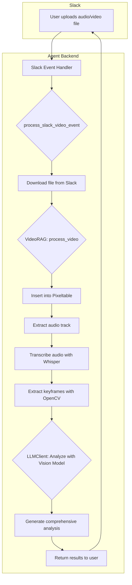

# Retrieval-Augmented Generation (RAG) System

This document provides an overview of the RAG system used in this project, including the workflows for handling audio and video data.

## Multimedia RAG Workflow (Audio & Video)

The system is capable of processing audio and video files shared in Slack to extract insights and generate responses. The following diagram illustrates the end-to-end workflow.

### Frameworks and Libraries Used

-   **`pixeltable`**: For creating and managing multimedia data tables.
-   **`whisper` (OpenAI)**: For audio transcription.
-   **`opencv-python`**: For video frame extraction and analysis.
-   **`iontel vision model`**: For analyzing video frames and audio transcripts.
-   **`requests`**: For downloading files from Slack.
-   **`PydanticAI`**: For interacting with the vision model.

### Workflow Diagram

### Detailed Steps

1.  **File Upload:** A user uploads an audio or video file to a Slack channel where the bot is present.
2.  **Event Handling:** The `SlackBotHandler` receives a `file_share` event.
3.  **File Download:** The `process_slack_video_event` function downloads the file from Slack's private URL using the bot token for authorization.
4.  **Video/Audio Processing:** The downloaded file is passed to the `VideoRAG.process_video` method.
5.  **Pixeltable Integration:** The video is inserted into a `pixeltable` table, which automatically triggers computed columns for:
    *   **Audio Extraction:** The audio track is extracted from the video.
    *   **Transcription:** The extracted audio is transcribed using OpenAI's Whisper model.
6.  **Frame Extraction:** Keyframes are extracted from the video at different intervals (beginning, middle, and end) using `opencv-python`.
7.  **Vision Model Analysis:** The extracted frames and the audio transcript are sent to a vision-capable LLM via the `LLMClient`.
8.  **Comprehensive Analysis:** The LLM generates a detailed analysis of the video's content, combining both visual and audio information.
9.  **Response to User:** The final analysis, including the audio transcript and video understanding, is sent back to the user in the Slack thread.
