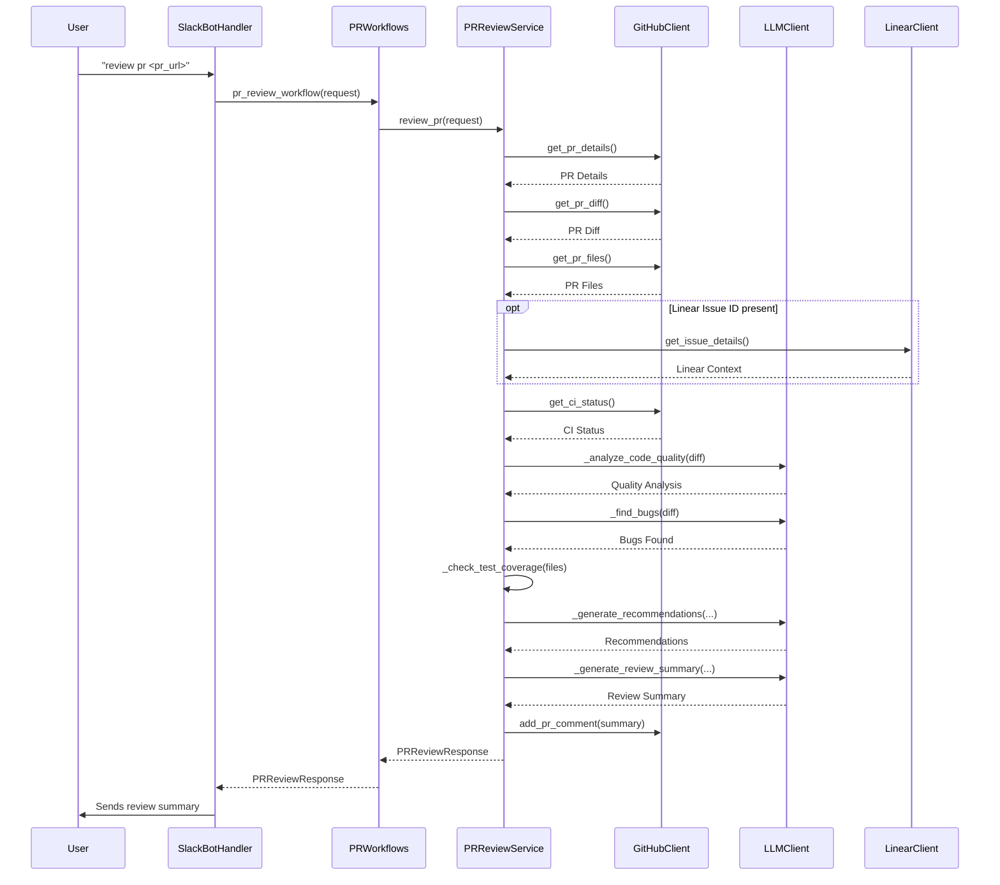
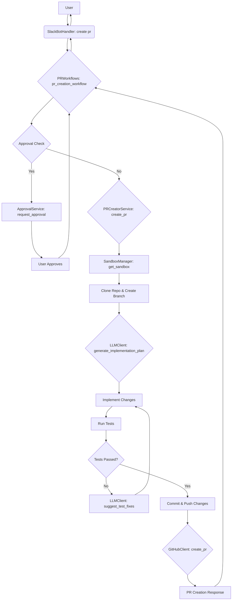

# Developer Services

This module contains services related to developer workflows, such as PR review, PR creation, handling PR comments, and Trivy vulnerability remediation.

## PR Review Workflow

The following diagram illustrates the PR review workflow, including the creation of a sandbox environment and all the steps involved.



## Create PR Workflow

The following diagram illustrates the workflow for creating a new pull request.



## Trivy Vulnerability Remediation Workflow

Automated workflow that takes Trivy vulnerability output (raw text or JSON), analyzes the repository, plans remediations (e.g., bump vulnerable Python packages, update Dockerfile base images, harden configs), applies changes in a sandbox, runs tests, and opens a remediation PR.

```mermaid
graph TD
    A[User] --> B(SlackBotHandler: fix trivy vulnerability);
    B --> C{PRWorkflows: trivy_vulnerability_workflow};
    C --> D[PRCreatorService: create_trivy_pr];
    D --> E[SandboxManager: get_sandbox];
    E --> F[Clone Repo & Create Branch];
    F --> G[CodeAnalyzer: analyze_repository + get_code_context];
    G --> H[Parse Trivy JSON/raw logs];
    H --> I[LLMClient: remediation plan (file_changes)];
    I --> J[Implement changes];
    J --> K[Run Tests];
    K --> L{Tests Passed?};
    L -- No --> M[LLMClient: suggest_test_fixes];
    M --> J;
    L -- Yes --> N[Commit & Push];
    N --> O[GitHubClient: create_pr];
    O --> P[TrivyScanResponse to Workflow];
    P --> C;
    C --> B;
    B --> A;
```

### Supported Slack Commands & Formats

Multi-line (raw text logs):
```
fix trivy vulnerability
repo: https://github.com/owner/repo
branch: main
description: Fix Trivy vulnerabilities
logs:
<PASTE TRIVY TEXT OUTPUT HERE>
```

Multi-line (JSON):
```
fix trivy vulnerability
repo: https://github.com/owner/repo
branch: main
json:
{
  "Results": [ ... ]
}
```

One-line (raw text):
```
fix trivy vulnerability --repo=https://github.com/owner/repo --branch=main --desc="Fix Trivy vulns" --logs="<paste or brief>"
```

One-line (JSON):
```
fix trivy vulnerability --repo=https://github.com/owner/repo --branch=main --desc="Fix Trivy vulns" --json='{"Results":[...]}'
```

Notes:
- JSON input takes precedence when both JSON and raw logs are provided.
- JSON can be pasted in a code-fenced block after the `json:` key in the multi-line format.
- The handler also attempts to parse JSON from the `logs:` section if it starts with `{` or `[`.

### JSON Schema Handling

The parser supports common Trivy JSON fields and maps them to an internal TrivyFinding model:

- Top-level:
  - `Results[]` with per-target scan info.
  - Each result may include `Target`, `Class` or `Type` (e.g., os-pkgs, lang-pkgs, config, secret).
- Package vulnerabilities:
  - `Vulnerabilities[]` with fields:
    - `VulnerabilityID` or `VulnID`
    - `PkgName`, `InstalledVersion`, `FixedVersion`
    - `PrimaryURL`, `References[]` (array of URLs)
    - `PkgPath` (if present) or falls back to `Target`
- Misconfigurations:
  - `Misconfigurations[]` with:
    - `ID` or `RuleID`, `Title`, `Description` or `Message`, `Severity`, `References[]` (list or objects with `URL`)
- Secrets:
  - `Secrets[]` with:
    - `RuleID`, `Title`, `Description` or `Match`, `Severity`, `Category`

When JSON is not available, a heuristic parser extracts CVE, severity, package, versions, and paths from raw text, and can detect base image references for Dockerfile updates.

### Remediation Planning (LLM Prompt Summary)

The service constructs a security-focused plan prompt that includes:
- Repository analysis (primary language, frameworks, entry points, test frameworks)
- Trimmed code context
- Findings summarized into:
  - Dependencies to bump (e.g., `package current -> fixed`)
  - Misconfigurations to address
  - Secrets to handle

Rules enforced in the prompt:
- Prefer updating Python dependencies in `requirements.txt` or constraint files; minimal bumps to `FixedVersion` when available.
- Update Dockerfile `FROM` to a patched base image when required, with justification.
- Harden misconfigurations in appropriate config files (Dockerfile, YAML, TOML, JSON) and explain changes via inline comments.
- Do NOT commit secrets; replace with environment variables or placeholders and document changes in the PR body.
- Preserve formatting and non-security content; only change necessary files.

The LLM returns a JSON plan with:
```
{
  "summary": "...",
  "file_changes": [
    {
      "path": "relative/path",
      "type": "modify|create|delete",
      "content": "FULL desired file content",
      "reasoning": "why this change fixes the issue"
    }
  ],
  "dependencies": []
}
```

### Implementation & PR Creation

- All changes are applied inside a sandbox:
  - Clone target repo and create a new branch (default: `security/trivy-fixes-<id>`).
  - Apply `file_changes` exactly as provided by the plan.
  - Run tests; if they fail, attempt LLM-guided fixes and re-run tests.
  - Commit and push the branch.
  - Open a PR via GitHub API with a detailed body:
    - Summary of approach
    - Files modified/created
    - Trivy findings addressed (ID, severity, package/version, location)
    - Any unresolved findings that require manual review

Unresolved findings:
- A heuristic determines unresolved items by checking if planned file changes target the same file/area as the finding (e.g., `requirements*.txt` for library CVEs, `Dockerfile` for base image issues, config files for misconfigurations). Unmatched findings are listed for manual follow-up.

#### UV-managed Python Repos
- Detection:
  - Detected when `uv.lock` exists, or when `pyproject.toml` exists and no `requirements.txt` is present.
- Remediation behavior:
  - Update dependency versions in `pyproject.toml`, not `requirements.txt`.
  - Do not include `uv.lock` in `file_changes`; the lockfile is regenerated via `uv lock`.
  - The service runs `uv lock` and `uv sync` before tests to ensure the environment matches the updated lockfile.
  - If the `uv` CLI is unavailable in the sandbox, a warning is logged and the flow falls back to `pip` installation where feasible.
- Resolution heuristic:
  - Changes to `pyproject.toml` are treated as addressing library CVEs (similar to `requirements*.txt`).

### Data Models (pydantic)

- `TrivyFinding`:
  - `id`, `severity`, `title?`, `description?`, `package_name?`, `current_version?`, `fixed_version?`, `installed_path?`, `references[]`, `type?`, `target?`
- `TrivyScanRequest`:
  - `repo_url`, `base_branch`, `branch_name?`, `description?`,
  - `trivy_raw_logs`, `trivy_json?`,
  - `thread_id`, `channel_id`, `user_id`
- `TrivyFixChange`:
  - `path`, `type`, `content`, `reasoning?`
- `TrivyScanResponse`:
  - `pr_url`, `branch_name`, `commits[]`, `files_changed[]`,
  - `fixes_applied[]: TrivyFixChange`, `unresolved_findings[]: TrivyFinding`, `summary`

### Programmatic Usage

- Workflow:
  - `PRWorkflows.trivy_vulnerability_workflow(request: TrivyScanRequest) -> TrivyScanResponse`
- Service:
  - `PRCreatorService.create_trivy_pr(request: TrivyScanRequest) -> TrivyScanResponse`
- Slack handler (Developer bot):
  - Listens for: `fix trivy vulnerability`
  - Accepts the command formats described above.

### Example: JSON One-Liner

```
fix trivy vulnerability \
  --repo=https://github.com/owner/repo \
  --branch=main \
  --desc="Fix Trivy vulns" \
  --json='{
    "Results":[
      {
        "Target":"requirements.txt",
        "Class":"lang-pkgs",
        "Type":"pip",
        "Vulnerabilities":[
          {
            "VulnerabilityID":"CVE-2024-12345",
            "PkgName":"requests",
            "InstalledVersion":"2.28.0",
            "FixedVersion":"2.32.3",
            "Severity":"HIGH",
            "PrimaryURL":"https://avd.aquasec.com/nvd/cve-2024-12345"
          }
        ]
      }
    ]
  }'
