# Developer Services

This module contains services related to developer workflows, such as PR review, PR creation, and handling PR comments.

## PR Review Workflow

The following diagram illustrates the PR review workflow, including the creation of a sandbox environment and all the steps involved.

```mermaid
sequenceDiagram
    participant User
    participant SlackBotHandler
    participant PRWorkflows
    participant PRReviewService
    participant GitHubClient
    participant LLMClient
    participant LinearClient

    User->>SlackBotHandler: "review pr <pr_url>"
    SlackBotHandler->>PRWorkflows: pr_review_workflow(request)
    PRWorkflows->>PRReviewService: review_pr(request)
    
    PRReviewService->>GitHubClient: get_pr_details()
    GitHubClient-->>PRReviewService: PR Details
    
    PRReviewService->>GitHubClient: get_pr_diff()
    GitHubClient-->>PRReviewService: PR Diff
    
    PRReviewService->>GitHubClient: get_pr_files()
    GitHubClient-->>PRReviewService: PR Files
    
    opt Linear Issue ID present
        PRReviewService->>LinearClient: get_issue_details()
        LinearClient-->>PRReviewService: Linear Context
    end
    
    PRReviewService->>GitHubClient: get_ci_status()
    GitHubClient-->>PRReviewService: CI Status
    
    PRReviewService->>LLMClient: _analyze_code_quality(diff)
    LLMClient-->>PRReviewService: Quality Analysis
    
    PRReviewService->>LLMClient: _find_bugs(diff)
    LLMClient-->>PRReviewService: Bugs Found
    
    PRReviewService->>PRReviewService: _check_test_coverage(files)
    
    PRReviewService->>LLMClient: _generate_recommendations(...)
    LLMClient-->>PRReviewService: Recommendations
    
    PRReviewService->>LLMClient: _generate_review_summary(...)
    LLMClient-->>PRReviewService: Review Summary
    
    PRReviewService->>GitHubClient: add_pr_comment(summary)
    
    PRReviewService-->>PRWorkflows: PRReviewResponse
    PRWorkflows-->>SlackBotHandler: PRReviewResponse
    SlackBotHandler->>User: Sends review summary
```

## Create PR Workflow

The following diagram illustrates the workflow for creating a new pull request.

