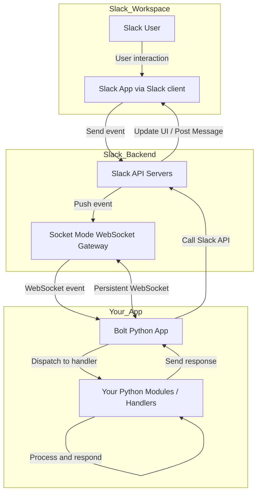

# Slack Bot Setup

This guide provides detailed instructions for setting up and running the Slack bot for this project.

## 1. Create a Slack App

The easiest way to set up your Slack app is by using the provided manifest file.

1.  **Go to the [Create App page](https://api.slack.com/apps/new)** and select "From an app manifest".
2.  **Choose your workspace** for the installation.
3.  **Copy the contents of `manifest.json`** from the root of this project into the JSON text box.
4.  **Review the configuration** and click "Create".
5.  **Install the app to your workspace** by clicking "Install to Workspace" and then "Allow".

## 2. Configure Environment Variables

After creating the app, you need to configure the necessary environment variables.

1.  **Bot Token:**
    *   In your app's configuration page, go to **OAuth & Permissions**.
    *   Copy the **Bot User OAuth Token** (it starts with `xoxb-`).
    *   Set this value as the `SLACK_BOT_TOKEN` environment variable.

2.  **App-Level Token:**
    *   Go to **Basic Information**.
    *   In the **App-Level Tokens** section, create a new token with the `connections:write` scope.
    *   Set this value as the `SLACK_APP_TOKEN` environment variable.

3.  **OpenAI API Key:**
    *   This project uses OpenAI's API by default. You will need to provide your own API key.
    *   Set this value as the `OPENAI_API_KEY` environment variable.

You can set these variables in a `.env` file in the root of the project:

```
SLACK_BOT_TOKEN="xoxb-..."
SLACK_APP_TOKEN="xapp-..."
OPENAI_API_KEY="sk-..."
```

## 3. Set Up Your Local Project

1.  **Clone the repository:**
    ```bash
    git clone https://github.com/rajagurunath/software-engineering-agents.git
    cd software-engineering-agents
    ```

2.  **Set up a Python virtual environment:**
    ```bash
    python3 -m venv .venv
    source .venv/bin/activate
    ```
    *(For Windows, use `.venv\Scripts\activate`)*

3.  **Install the dependencies:**
    ```bash
    pip install -r requirements.txt
    ```

## 4. Run the App

Once your environment is configured, you can start the bot:

```bash
python3 slack_bot_main.py
```

Your bot should now be running and connected to your Slack workspace.


